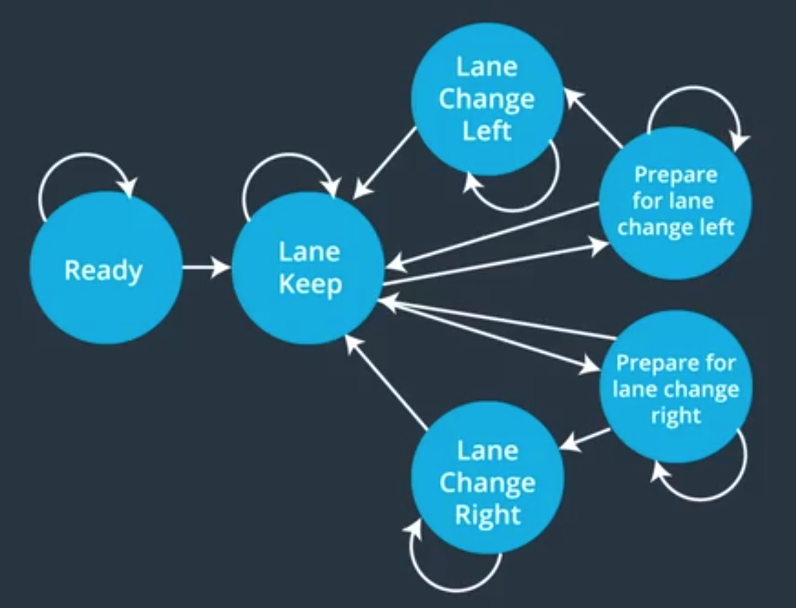

# behavior_planner

## Finite State Machine



## Behavior Planning Pseudocode

One way to implement a transition function is by generating rough trajectories for each accessible "next state" and then finding the best. To "find the best" we generally use cost functions. We can then figure out how costly each rough trajectory is and then select the state with the lowest cost trajectory.

```python
def transition_function(predictions, current_fsm_state, current_pose, cost_functions, weights):
    # only consider states which can be reached from current FSM state.
    possible_successor_states = successor_states(current_fsm_state)

    # keep track of the total cost of each state.
    costs = []
    for state in possible_successor_states:
        # generate a rough idea of what trajectory we would
        # follow IF we chose this state.
        trajectory_for_state = generate_trajectory(state, current_pose, predictions)

        # calculate the "cost" associated with that trajectory.
        cost_for_state = 0
        for i in range(len(cost_functions)) :
            # apply each cost function to the generated trajectory
            cost_function = cost_functions[i]
            cost_for_cost_function = cost_function(trajectory_for_state, predictions)

            # multiply the cost by the associated weight
            weight = weights[i]
            cost_for_state += weight * cost_for_cost_function
         costs.append({'state' : state, 'cost' : cost_for_state})

    # Find the minimum cost state.
    best_next_state = None
    min_cost = 9999999
    for i in range(len(possible_successor_states)):
        state = possible_successor_states[i]
        cost  = costs[i]
        if cost < min_cost:
            min_cost = cost
            best_next_state = state 

    return best_next_state
```